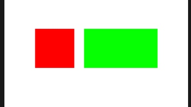

# Masonry Tips
[TOC]

## 两个view 整体水平居中
需要借助一个辅助view


```
 UIView *helperView = [UIView new];//辅助视图
    [self.view addSubview:helperView];
    
    UIView *leftView = [UIView new];
    leftView.backgroundColor = [UIColor redColor];
    
    UIView *rightView = [UIView new];
    rightView.backgroundColor = [UIColor greenColor];
    
    [helperView addSubview:leftView];
    [helperView addSubview:rightView];
    
    [helperView mas_makeConstraints:^(MASConstraintMaker *make) {
        make.centerX.mas_equalTo(self.view);//重要的一行
        make.top.mas_equalTo(self.view).offset(200);
        make.height.mas_equalTo(80);
    }];
    
    [leftView mas_makeConstraints:^(MASConstraintMaker *make) {
        make.left.mas_equalTo(helperView);//重要的一行
        make.centerY.mas_equalTo(helperView);
        make.size.mas_equalTo(CGSizeMake(80, 80));
    }];
    
    [rightView mas_makeConstraints:^(MASConstraintMaker *make) {
        make.right.mas_equalTo(helperView);//重要的一行
        make.centerY.mas_equalTo(helperView);
        make.left.mas_equalTo(leftView.mas_right).offset(20);
        make.size.mas_equalTo(CGSizeMake(150, 80));
    }];
```
## UIScrollView自动布局

UIScrollView依靠与其subviews之间的约束来确定ContentSize的大小，所以需要加一个container来处理

```
UIView *container = [UIView new];
[scrollView addSubview:container];
[container mas_makeConstraints:^(MASConstraintMaker *make) {
    make.edges.equalTo(scrollView);
    make.width.equalTo(scrollView);
}];
```