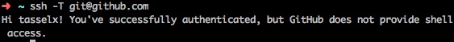

1. 首先创建 SSH Key 
```
#切换到.ssh目录
cd ~/.ssh  
#使用自己的企业邮箱产生SSH KEY
ssh-keygen -t rsa -C "mywork@email.com"  
#企业的可以使用id_rsa，也可以自己起名，例如：id_rsa_work
Enter file in which to save the key (/Users/ltc/.ssh/id_rsa): id_rsa 
#将ssh key添加到SSH agent中
ssh-add ~/.ssh/id_rsa //记得添加这个
```
2. 编写config文件
```
#切换到.ssh目录
cd ~/.ssh
#创建并编辑config文件
vim config 
# 粘贴到config文件中
#公司的git地址
Host git.***.com  
   User git
   Hostname git.***.com  #公司的git地址
   IdentityFile ~/.ssh/id_rsa  #访问公司git的SSH KEY
   Port   ***  #公司的git端口
Host github.com
   User git
   Hostname github.com #github的地址
   IdentityFile ~/.ssh/id_rsa_github  #访问github的SSH KEY

```
多个github账号的话
```
Host github.com  
    HostName github.com  
    PreferredAuthentications publickey  
    IdentityFile ~/.ssh/id_rsa  
  
Host my.github.com  
    HostName github.com  
    PreferredAuthentications publickey  
    IdentityFile ~/.ssh/my 

//host可以自己定义
```
然后记得在git服务器配置ssh公钥

* 最后测试下
`ssh -T git@github.com`

